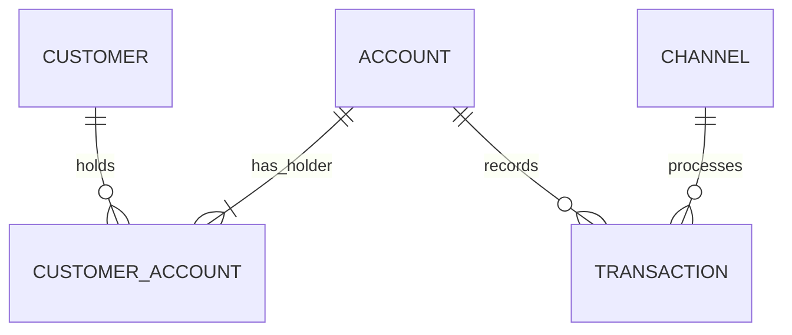
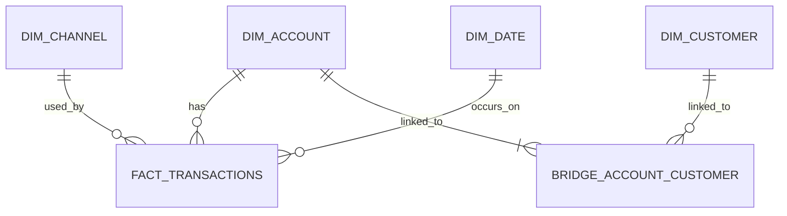

# Banking Reporting Platform

A compact end-to-end **data engineering and analytics portfolio project** that models a retail banking transaction workflow from source data through validation, PostgreSQL dimensional modelling, and Metabase reporting.

The project is built with synthetic data and is intended to demonstrate practical data-engineering skills rather than reproduce any bank's internal systems or data.

> **Note:** This is an independent portfolio project using synthetic data. It is not affiliated with, endorsed by, or based on proprietary data from any other bank.

---

## Project Overview

The platform models one core retail banking business process:

> **Processing retail banking transactions**

The project starts with synthetic CSV source extracts, profiles and validates them, ingests them into PostgreSQL, applies data-quality rules, builds a dimensional reporting model, and exposes the final marts to Metabase.

```text
Synthetic CSV Files
        ↓
       raw
        ↓
     staging
        ↓
      marts
        ↓
    Metabase
```

The project deliberately stays small enough to understand end to end while still demonstrating realistic concepts such as:

- source profiling
- raw ingestion
- data-quality validation
- rejected-record auditing
- many-to-many modelling
- dimensional modelling
- surrogate keys
- SCD Type 1
- fact and dimension tables
- bridge-table allocation
- reconciliation checks
- reporting-ready marts
- interactive dashboard filters

---

## Technology Stack

| Area | Technology |
|---|---|
| Language | Python 3.13 |
| Python environment | uv |
| Data processing | pandas |
| Database | PostgreSQL 17 |
| PostgreSQL driver | psycopg |
| Local infrastructure | Docker Compose |
| Analytics / BI | Metabase |
| Development environment | VS Code + Jupyter |
| Version control | Git + GitHub |

---

## Repository Structure

```text
banking-reporting-platform/
│
├── data/
│   └── raw/
│       ├── customers.csv
│       ├── accounts.csv
│       ├── customer_accounts.csv
│       └── transactions.csv
│
├── docker/
│   └── postgres/
│       └── init/
│           ├── 01_create_metabase_database.sql
│           └── 02_create_analytics_schemas.sql
│
├── docs/
│   ├── data-modelling/
│   │   ├── 01_data_modelling_foundation.md
│   │   ├── 02_conceptual_data_model.md
│   │   ├── 03_logical_data_model.md
│   │   ├── 04_physical_data_model.md
│   │   ├── 05_dimensional_data_model.md
│   │   ├── 06_source_to_target_mapping.md
│   │   └── 07_data_dictionary.md
│   │
│   └── dashboard/
│       └── retail-banking-transaction-overview.pdf
│
├── notebooks/
│   ├── 01_source_profiling_and_validation.ipynb
│   ├── 02_ingest_raw.ipynb
│   ├── 03_transform_staging.ipynb
│   ├── 04_build_marts.ipynb
│   └── 05_data_quality_checks.ipynb
│
├── sql/
│   ├── marts/
│   └── staging/
│
├── tests/
│
├── .env.example
├── .gitignore
├── .python-version
├── compose.yaml
├── pyproject.toml
├── README.md
└── uv.lock
```

> The `data/raw` files are ignored by Git in the current development setup. A fresh clone therefore needs the synthetic source files placed in `data/raw` before the notebooks are run.

---

## Business Process

The project models retail banking customers, accounts, ownership relationships, transaction channels, and financial transactions.

The core entities are:

```text
Customer
Account
Customer Account
Transaction
Channel
```

### Many-to-Many Relationship

A customer can hold multiple accounts, and an account can have multiple customers.

```text
CUSTOMER M:N ACCOUNT
```

The many-to-many relationship is resolved using:

```text
CUSTOMER_ACCOUNT
```

This allows the model to support both individual and joint accounts.

---

## Conceptual Relationships



Key business rules include:

- a customer may hold multiple accounts
- an account must have at least one holder
- every account must have exactly one `PRIMARY` holder
- an account may also have `JOINT` holders
- every transaction belongs to exactly one account
- every transaction uses exactly one valid channel
- transaction amount must be greater than zero
- transactions cannot occur after an account has closed
- invalid source records are preserved in the audit layer

---

## Synthetic Source Data

The current source design contains four extracts:

| File | Valid baseline |
|---|---:|
| `customers.csv` | 1,000 customers |
| `accounts.csv` | 1,250 accounts |
| `customer_accounts.csv` | 1,350 relationships |
| `transactions.csv` | 50,000 transactions |

The customer-account extract includes **100 joint accounts**.

A small controlled set of invalid records is intentionally included so the pipeline can demonstrate data-quality detection and auditing.

Examples include:

- duplicate business keys
- malformed dates
- invalid domain values
- unknown customer or account references
- duplicate customer-account relationships
- multiple primary holders
- invalid channel codes
- non-numeric transaction amounts
- negative transaction amounts
- invalid transaction statuses
- transactions occurring after account closure

---

## Database Architecture

PostgreSQL is organised into four schemas.

### `raw`

Stores source records as received.

Source business fields are intentionally stored as `TEXT` so malformed values can be preserved rather than rejected by PostgreSQL before validation.

Every raw table also contains:

```text
_source_file
_ingested_at
```

### `staging`

Stores validated and correctly typed data.

```text
staging.customers
staging.accounts
staging.customer_accounts
staging.channels
staging.transactions
```

### `audit`

Stores invalid source records.

```text
audit.rejected_records
```

Each rejected row contains:

- source name
- record key
- rejection reason
- original raw payload
- rejection timestamp

### `marts`

Stores the reporting-ready dimensional model consumed by Metabase.

```text
marts.dim_customer
marts.dim_account
marts.dim_channel
marts.dim_date
marts.bridge_account_customer
marts.fact_transactions
```

---

## Dimensional Model

The primary fact table is:

```text
marts.fact_transactions
```

### Fact Grain

> **One row per validated financial transaction processed against one account.**

### Dimensions

```text
dim_customer
dim_account
dim_channel
dim_date
```

### Bridge

```text
bridge_account_customer
```

The bridge resolves the many-to-many relationship between customers and accounts.



---

## Joint-Account Allocation

A transaction belongs to an account, not directly to one customer.

If a joint account has two holders, joining that transaction directly to both customers would duplicate the transaction value.

The bridge therefore contains:

```text
allocation_weight
```

The weight is calculated as:

```text
1 / number_of_account_holders
```

Examples:

| Holders | Weight per holder |
|---:|---:|
| 1 | 1.000000 |
| 2 | 0.500000 |
| 3 | 0.333333 |

Customer-level allocated transaction value is calculated as:

```text
transaction_amount × allocation_weight
```

This allows customer-level allocated totals to reconcile back to the original account-level transaction value.

---

## Slowly Changing Dimensions

The project explicitly uses **SCD Type 1** for:

```text
marts.dim_customer
marts.dim_account
```

Type 1 behaviour:

```text
new business key
→ INSERT new dimension row

existing business key
→ UPDATE existing row
→ retain surrogate key
```

Changed descriptive values overwrite the previous values.

The project intentionally does not use Type 2 history fields such as:

```text
valid_from
valid_to
is_current
version_number
```

SCD Type 2 would become appropriate if reporting requirements later needed the historical state of a customer or account at the exact time a transaction occurred.

---

## Pipeline Notebooks

The pipeline is intentionally notebook-first.

### 01 — Source Profiling and Validation

`notebooks/01_source_profiling_and_validation.ipynb`

Checks the files before database loading.

It profiles:

- expected file delivery
- expected columns
- blanks
- duplicate business keys
- domain values
- date and numeric parsing
- referential integrity
- account lifecycle rules

No source rows are modified in this notebook.

### 02 — Raw Ingestion

`notebooks/02_ingest_raw.ipynb`

Loads all source records into PostgreSQL.

```text
CSV
 ↓
raw
```

The notebook:

- reads connection settings from `.env`
- creates raw tables if needed
- full-refreshes the raw layer
- uses PostgreSQL `COPY`
- preserves invalid records
- adds ingestion metadata
- reconciles source counts to raw-table counts

### 03 — Staging Transformation

`notebooks/03_transform_staging.ipynb`

Introduces the main data-quality boundary.

```text
raw
 │
 ├── valid   → staging
 │
 └── invalid → audit.rejected_records
```

The duplicate policy is:

> **First valid occurrence wins; later duplicate occurrences are rejected.**

### 04 — Build Marts

`notebooks/04_build_marts.ipynb`

Builds the reporting model.

```text
staging
   ↓
dim_customer
dim_account
dim_channel
dim_date
bridge_account_customer
fact_transactions
```

It also:

- performs SCD Type 1 dimension upserts
- preserves existing surrogate keys
- generates the date dimension
- calculates joint-account allocation weights
- builds the transaction fact table
- reconciles staging to marts

### 05 — End-to-End Data Quality Checks

`notebooks/05_data_quality_checks.ipynb`

Runs the final quality gate before reporting.

Checks include:

- required table existence
- row-count reconciliation
- business-key uniqueness
- referential integrity
- business rules
- domain values
- staging-to-mart coverage
- SCD Type 1 physical design
- fact-table grain
- bridge integrity
- allocation reconciliation
- KPI sanity checks
- rejected-record audit visibility

---

## Reporting Dashboard

Metabase connects to the PostgreSQL `analytics` database and reports primarily from the `marts` schema.

The dashboard is:

> **Retail Banking Transaction Overview**

### KPI Cards

- Total Transactions
- Total Transaction Value
- Transaction Success Rate
- Failed Transactions

### Visualisations

- Transaction Volume Over Time
- Transaction Value by Channel
- Transactions by Account Type

### Dashboard Filters

- Date
- Channel
- Account Type
- Status

---

## Dashboard Preview

The completed Metabase dashboard is included as a PDF export:

[View the Retail Banking Transaction Overview dashboard](docs/dashboard/retail-banking-transaction-overview.pdf)

The PDF captures the portfolio dashboard containing the KPI cards and reporting visualisations described above.

---

## Example Dashboard Results

For the current synthetic dataset, the dashboard shows approximately:

| Metric | Result |
|---|---:|
| Total Transactions | 50,000 |
| Total Transaction Value | R128.6M |
| Transaction Success Rate | 96.47% |
| Failed Transactions | 1,250 |

These values come from synthetic data and are not intended to represent real banking performance.

---

## Local Setup

### Prerequisites

Install:

- Git
- Docker Desktop
- VS Code
- uv

### 1. Clone the repository

```bash
git clone https://github.com/black-panther-is-mpondo/banking-reporting-platform.git
cd banking-reporting-platform
```

### 2. Install Python dependencies

```bash
uv sync
```

### 3. Create the local environment file

Copy `.env.example` to `.env`, then provide local development values.

Example:

```text
POSTGRES_USER=banking_admin
POSTGRES_PASSWORD=your_local_password
POSTGRES_DB=analytics
POSTGRES_PORT=5432
```

Do not commit `.env`.

### 4. Start PostgreSQL and Metabase

```bash
docker compose up -d
```

Check container status:

```bash
docker compose ps
```

### 5. Add the synthetic source extracts

Place these files under `data/raw/`:

```text
customers.csv
accounts.csv
customer_accounts.csv
transactions.csv
```

### 6. Run the notebooks in order

```text
01_source_profiling_and_validation.ipynb
02_ingest_raw.ipynb
03_transform_staging.ipynb
04_build_marts.ipynb
05_data_quality_checks.ipynb
```

### 7. Open Metabase

```text
http://localhost:3000
```

Connect Metabase to the analytics database using:

```text
Host: postgres
Port: 5432
Database: analytics
```

Sync the database schema if the mart tables are not immediately visible.

---

## Design Decisions

### Why PostgreSQL?

PostgreSQL provides a simple relational platform for demonstrating schema separation, constraints, foreign keys, dimensional modelling, and SQL reporting.

### Why Metabase?

Metabase provides a lightweight open-source BI layer that can sit directly on top of the reporting marts.

### Why notebooks?

The project is designed as an educational and portfolio workflow where each pipeline stage can be opened, inspected, executed, and discussed independently.

### Why no Airflow, Spark, or Kafka?

They are not necessary for the current problem.

The goal is to demonstrate a complete and correct data pipeline rather than maximise the number of technologies used.

---

## Current Scope

Included:

- synthetic retail banking data
- batch CSV ingestion
- PostgreSQL raw/staging/mart layers
- data-quality auditing
- dimensional modelling
- SCD Type 1
- joint-account bridge
- Metabase dashboard

Not currently included:

- real banking data
- real-time processing
- orchestration
- CDC
- SCD Type 2
- fraud detection
- lending
- credit scoring
- AML/KYC
- production cloud deployment

---

## Future Improvements

Possible extensions include:

- add a reproducible synthetic-data generator to the repository
- introduce SCD Type 2 where historical dimension state is required
- add automated unit and integration tests
- move analytical PostgreSQL to a hosted service
- deploy Metabase to a hosted environment
- add incremental transaction ingestion
- add pipeline-run audit metadata
- introduce CI checks for notebook and SQL quality

---

## Project Status

```text
Data modelling                     ✅
Synthetic source design            ✅
Source profiling                   ✅
Raw ingestion                      ✅
Staging validation                 ✅
Rejected-record auditing           ✅
Dimensional marts                  ✅
SCD Type 1                         ✅
Joint-account bridge               ✅
End-to-end quality gate            ✅
Metabase dashboard                 ✅
```

The project is functionally complete for the current local portfolio scope.
