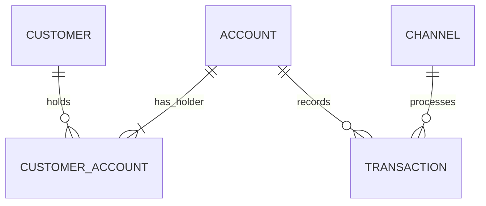

# 02 — Conceptual Data Model

## 1. Purpose

The conceptual model represents the banking domain at business level. It identifies the important entities, relationships, cardinality, and optionality without introducing PostgreSQL tables, data types, or implementation-specific constraints.

## 2. Business Process

> **Processing retail banking transactions.**

A customer can hold one or more accounts, an account can be shared by multiple customers, and transactions are processed against accounts through a channel.

## 3. Conceptual Entities

### Customer

A person recognised by the bank as a retail customer.

### Account

A retail banking account that can be owned by one or more customers.

### Customer Account

The business relationship between a customer and an account. This resolves the many-to-many relationship and identifies whether the customer is the primary or a joint holder.

### Transaction

A financial event processed against an account.

### Channel

The mechanism through which a transaction is initiated or processed.

## 4. Relationship Definitions

| Relationship | Cardinality | Optionality | Meaning |
|---|---|---|---|
| Customer → Customer Account | 1:M | Customer may have 0..M account relationships | A customer may exist before holding an active account |
| Account → Customer Account | 1:M | Account must have 1..M holders | Every account must have at least one customer |
| Customer ↔ Account | M:N | Resolved through Customer Account | Supports customers with multiple accounts and joint accounts |
| Account → Transaction | 1:M | Account may have 0..M transactions | A new or inactive account may have no transactions |
| Channel → Transaction | 1:M | Channel may have 0..M transactions | Every transaction uses one channel |

## 5. Conceptual ERD



## 6. Conceptual Business Rules

- A customer can hold multiple accounts.
- An account can be held by multiple customers.
- Customer–Account ownership is represented explicitly.
- Every account has at least one account holder.
- Every transaction belongs to exactly one account.
- Every transaction is processed through exactly one channel.
- An account can exist before any transaction is recorded.
- A channel can exist even when no transaction currently uses it.

## 7. Scope Boundary

The conceptual model deliberately stops at:

```text
Customer
Account
Customer Account
Transaction
Channel
```

No additional entities are introduced unless a later reporting requirement cannot be satisfied without them.
