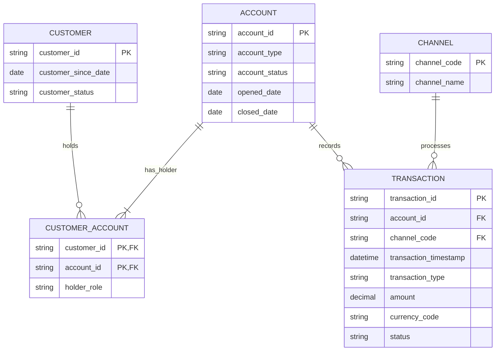

# 03 — Logical Data Model

## 1. Purpose

The logical data model defines entities, attributes, keys, relationships, optionality, and domain rules independently of PostgreSQL-specific data types.

The design is normalised to avoid unnecessary duplication while remaining small enough for the portfolio scope.

## 2. Entities and Attributes

### Customer

**Grain:** one row per customer.

| Attribute | Role | Required | Description |
|---|---|---:|---|
| `customer_id` | Primary key | Yes | Unique business identifier |
| `customer_since_date` | Attribute | Yes | Date the customer relationship began |
| `customer_status` | Attribute | Yes | Current customer status |

Allowed `customer_status` values:

```text
ACTIVE
INACTIVE
```

### Account

**Grain:** one row per account.

| Attribute | Role | Required | Description |
|---|---|---:|---|
| `account_id` | Primary key | Yes | Unique business identifier |
| `account_type` | Attribute | Yes | Type of retail account |
| `account_status` | Attribute | Yes | Current account status |
| `opened_date` | Attribute | Yes | Date the account opened |
| `closed_date` | Attribute | No | Date the account closed, when applicable |

Allowed `account_type` values:

```text
TRANSACTION
SAVINGS
```

Allowed `account_status` values:

```text
ACTIVE
DORMANT
CLOSED
```

### Customer Account

**Grain:** one row per customer-account relationship.

| Attribute | Role | Required | Description |
|---|---|---:|---|
| `customer_id` | PK/FK | Yes | References Customer |
| `account_id` | PK/FK | Yes | References Account |
| `holder_role` | Attribute | Yes | Customer's ownership role on the account |

Composite primary key:

```text
(customer_id, account_id)
```

Allowed `holder_role` values:

```text
PRIMARY
JOINT
```

Each account must have exactly one `PRIMARY` holder.

### Channel

**Grain:** one row per channel.

| Attribute | Role | Required | Description |
|---|---|---:|---|
| `channel_code` | Primary key | Yes | Stable channel code |
| `channel_name` | Attribute | Yes | Human-readable channel name |

Initial values:

| `channel_code` | `channel_name` |
|---|---|
| `APP` | Mobile App |
| `ATM` | ATM |
| `CARD` | Card |

### Transaction

**Grain:** one row per financial transaction.

| Attribute | Role | Required | Description |
|---|---|---:|---|
| `transaction_id` | Primary key | Yes | Unique transaction identifier |
| `account_id` | Foreign key | Yes | Account against which the transaction occurred |
| `channel_code` | Foreign key | Yes | Channel used |
| `transaction_timestamp` | Attribute | Yes | Date and time of transaction |
| `transaction_type` | Attribute | Yes | Type of transaction |
| `amount` | Measure | Yes | Absolute transaction value |
| `currency_code` | Attribute | Yes | Transaction currency |
| `status` | Attribute | Yes | Processing status |

Allowed `transaction_type` values:

```text
PURCHASE
WITHDRAWAL
DEPOSIT
TRANSFER
```

Allowed `status` values:

```text
SUCCESSFUL
FAILED
REVERSED
```

## 3. Logical ERD



## 4. Referential Integrity

- `CUSTOMER_ACCOUNT.customer_id` → `CUSTOMER.customer_id`
- `CUSTOMER_ACCOUNT.account_id` → `ACCOUNT.account_id`
- `TRANSACTION.account_id` → `ACCOUNT.account_id`
- `TRANSACTION.channel_code` → `CHANNEL.channel_code`

## 5. Normalisation Decisions

The logical model is designed to approximately third normal form for the current scope:

- Customer attributes live only in Customer.
- Account attributes live only in Account.
- Customer–Account ownership is separated into an associative entity.
- Channel names are normalised into Channel rather than repeated as free text in every transaction.
- Transaction stores only identifiers and transaction-specific attributes.

## 6. Logical Validation Rules

- Customer, account, and transaction business keys are unique.
- Customer Account composite key is unique.
- Amount must be positive.
- `closed_date` is null unless the account is closed.
- `closed_date` cannot be earlier than `opened_date`.
- Every account has exactly one `PRIMARY` holder.
- A transaction cannot reference an unknown account or channel.
- A transaction cannot occur after the linked account's `closed_date`.
