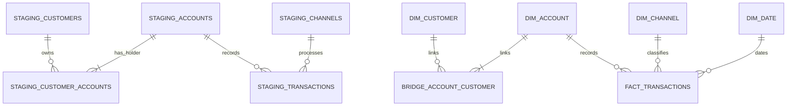

# 04 — Physical Data Model

## 1. Purpose

This document translates the logical model into the PostgreSQL structures used by the local project.

The database is divided into four schemas:

```text
raw
staging
marts
audit
```

## 2. Layer Responsibilities

### `raw`

Stores source data as received with minimal interpretation. Source fields are stored as text where practical so malformed values can still be captured and audited.

### `staging`

Stores validated, typed, cleaned, and standardised records.

### `marts`

Stores reporting-ready dimensional tables consumed by Metabase.

### `audit`

Stores rejected source records and their validation reasons.

---

## 3. Slowly Changing Dimension Strategy

The current project uses **Slowly Changing Dimension Type 1 (SCD Type 1)** for the descriptive dimensions that can change over time.

The affected dimensions are:

```text
marts.dim_customer
marts.dim_account
```

Under Type 1 handling:

- a new business key creates a new dimension row
- an existing business key updates the current row
- changed descriptive attributes overwrite the previous values
- historical versions of the dimension row are not retained

For example, if an account changes from:

```text
account_status = ACTIVE
```

to:

```text
account_status = DORMANT
```

the existing `marts.dim_account` row is updated.

The project therefore does **not** use SCD Type 2 columns such as:

```text
valid_from
valid_to
is_current
version_number
```

This decision keeps the first portfolio project intentionally small while still making the dimension-maintenance strategy explicit.

If future reporting requires analysis based on the historical state of a customer or account at the time of a transaction, the design can be extended to SCD Type 2.

---

## 4. Raw Tables

All raw tables include:

```text
_ingested_at TIMESTAMPTZ NOT NULL DEFAULT now()
_source_file TEXT NOT NULL
```

### `raw.customers`

| Column | PostgreSQL Type | Nullable |
|---|---|---:|
| `customer_id` | TEXT | Yes |
| `customer_since_date` | TEXT | Yes |
| `customer_status` | TEXT | Yes |
| `_ingested_at` | TIMESTAMPTZ | No |
| `_source_file` | TEXT | No |

### `raw.accounts`

| Column | PostgreSQL Type | Nullable |
|---|---|---:|
| `account_id` | TEXT | Yes |
| `account_type` | TEXT | Yes |
| `account_status` | TEXT | Yes |
| `opened_date` | TEXT | Yes |
| `closed_date` | TEXT | Yes |
| `_ingested_at` | TIMESTAMPTZ | No |
| `_source_file` | TEXT | No |

### `raw.customer_accounts`

| Column | PostgreSQL Type | Nullable |
|---|---|---:|
| `customer_id` | TEXT | Yes |
| `account_id` | TEXT | Yes |
| `holder_role` | TEXT | Yes |
| `_ingested_at` | TIMESTAMPTZ | No |
| `_source_file` | TEXT | No |

### `raw.transactions`

| Column | PostgreSQL Type | Nullable |
|---|---|---:|
| `transaction_id` | TEXT | Yes |
| `account_id` | TEXT | Yes |
| `transaction_timestamp` | TEXT | Yes |
| `transaction_type` | TEXT | Yes |
| `channel_code` | TEXT | Yes |
| `amount` | TEXT | Yes |
| `currency_code` | TEXT | Yes |
| `status` | TEXT | Yes |
| `_ingested_at` | TIMESTAMPTZ | No |
| `_source_file` | TEXT | No |

---

## 5. Staging Tables

### `staging.customers`

| Column | PostgreSQL Type | Constraint |
|---|---|---|
| `customer_id` | VARCHAR(20) | PK |
| `customer_since_date` | DATE | NOT NULL |
| `customer_status` | VARCHAR(10) | NOT NULL, CHECK |
| `loaded_at` | TIMESTAMPTZ | NOT NULL DEFAULT now() |

### `staging.accounts`

| Column | PostgreSQL Type | Constraint |
|---|---|---|
| `account_id` | VARCHAR(20) | PK |
| `account_type` | VARCHAR(20) | NOT NULL, CHECK |
| `account_status` | VARCHAR(10) | NOT NULL, CHECK |
| `opened_date` | DATE | NOT NULL |
| `closed_date` | DATE | NULL |
| `loaded_at` | TIMESTAMPTZ | NOT NULL DEFAULT now() |

### `staging.customer_accounts`

| Column | PostgreSQL Type | Constraint |
|---|---|---|
| `customer_id` | VARCHAR(20) | PK/FK |
| `account_id` | VARCHAR(20) | PK/FK |
| `holder_role` | VARCHAR(10) | NOT NULL, CHECK |
| `loaded_at` | TIMESTAMPTZ | NOT NULL DEFAULT now() |

Primary key:

```text
(customer_id, account_id)
```

### `staging.channels`

Derived from valid channel codes found in transaction data.

| Column | PostgreSQL Type | Constraint |
|---|---|---|
| `channel_code` | VARCHAR(10) | PK |
| `channel_name` | VARCHAR(50) | NOT NULL |

### `staging.transactions`

| Column | PostgreSQL Type | Constraint |
|---|---|---|
| `transaction_id` | VARCHAR(30) | PK |
| `account_id` | VARCHAR(20) | FK, NOT NULL |
| `channel_code` | VARCHAR(10) | FK, NOT NULL |
| `transaction_timestamp` | TIMESTAMP | NOT NULL |
| `transaction_type` | VARCHAR(20) | NOT NULL, CHECK |
| `amount` | NUMERIC(18,2) | NOT NULL, CHECK > 0 |
| `currency_code` | CHAR(3) | NOT NULL |
| `status` | VARCHAR(15) | NOT NULL, CHECK |
| `loaded_at` | TIMESTAMPTZ | NOT NULL DEFAULT now() |

---

## 6. Audit Table

### `audit.rejected_records`

| Column | PostgreSQL Type | Constraint |
|---|---|---|
| `rejection_id` | BIGINT GENERATED ALWAYS AS IDENTITY | PK |
| `source_name` | VARCHAR(50) | NOT NULL |
| `record_key` | TEXT | NULL |
| `rejection_reason` | TEXT | NOT NULL |
| `raw_payload` | JSONB | NOT NULL |
| `rejected_at` | TIMESTAMPTZ | NOT NULL DEFAULT now() |

---

## 7. Mart Tables

### `marts.dim_customer`

**SCD handling:** Type 1.

| Column | PostgreSQL Type | Constraint |
|---|---|---|
| `customer_key` | BIGINT GENERATED ALWAYS AS IDENTITY | PK |
| `customer_id` | VARCHAR(20) | UNIQUE, NOT NULL |
| `customer_since_date` | DATE | NOT NULL |
| `customer_status` | VARCHAR(10) | NOT NULL |

When the same `customer_id` is loaded again with changed descriptive attributes, the existing row is updated rather than versioned.

### `marts.dim_account`

**SCD handling:** Type 1.

| Column | PostgreSQL Type | Constraint |
|---|---|---|
| `account_key` | BIGINT GENERATED ALWAYS AS IDENTITY | PK |
| `account_id` | VARCHAR(20) | UNIQUE, NOT NULL |
| `account_type` | VARCHAR(20) | NOT NULL |
| `account_status` | VARCHAR(10) | NOT NULL |
| `opened_date` | DATE | NOT NULL |
| `closed_date` | DATE | NULL |

When the same `account_id` is loaded again with changed descriptive attributes, the existing row is updated rather than versioned.

### `marts.dim_channel`

| Column | PostgreSQL Type | Constraint |
|---|---|---|
| `channel_key` | SMALLINT GENERATED ALWAYS AS IDENTITY | PK |
| `channel_code` | VARCHAR(10) | UNIQUE, NOT NULL |
| `channel_name` | VARCHAR(50) | NOT NULL |

### `marts.dim_date`

| Column | PostgreSQL Type | Constraint |
|---|---|---|
| `date_key` | INTEGER | PK |
| `full_date` | DATE | UNIQUE, NOT NULL |
| `day_name` | VARCHAR(10) | NOT NULL |
| `month_number` | SMALLINT | NOT NULL |
| `month_name` | VARCHAR(10) | NOT NULL |
| `quarter_number` | SMALLINT | NOT NULL |
| `year` | SMALLINT | NOT NULL |

`date_key` uses `YYYYMMDD`.

### `marts.bridge_account_customer`

| Column | PostgreSQL Type | Constraint |
|---|---|---|
| `account_key` | BIGINT | PK/FK |
| `customer_key` | BIGINT | PK/FK |
| `holder_role` | VARCHAR(10) | NOT NULL |
| `allocation_weight` | NUMERIC(8,6) | NOT NULL, CHECK > 0 AND <= 1 |

Primary key:

```text
(account_key, customer_key)
```

`allocation_weight` equals:

```text
1 / number_of_account_holders
```

For a single-holder account the weight is `1.0`.

For a two-holder joint account each row receives `0.5`.

### `marts.fact_transactions`

| Column | PostgreSQL Type | Constraint |
|---|---|---|
| `transaction_key` | BIGINT GENERATED ALWAYS AS IDENTITY | PK |
| `transaction_id` | VARCHAR(30) | UNIQUE, NOT NULL |
| `account_key` | BIGINT | FK, NOT NULL |
| `channel_key` | SMALLINT | FK, NOT NULL |
| `date_key` | INTEGER | FK, NOT NULL |
| `transaction_timestamp` | TIMESTAMP | NOT NULL |
| `transaction_type` | VARCHAR(20) | NOT NULL |
| `amount` | NUMERIC(18,2) | NOT NULL |
| `currency_code` | CHAR(3) | NOT NULL |
| `status` | VARCHAR(15) | NOT NULL |

---

## 8. Index Strategy

The project keeps indexing minimal.

Recommended indexes:

- `staging.transactions(account_id)`
- `staging.transactions(transaction_timestamp)`
- `staging.transactions(channel_code)`
- `marts.fact_transactions(account_key)`
- `marts.fact_transactions(channel_key)`
- `marts.fact_transactions(date_key)`
- `marts.bridge_account_customer(customer_key)`

Primary-key and unique constraints provide their own supporting indexes.

---

## 9. Physical Relationships


