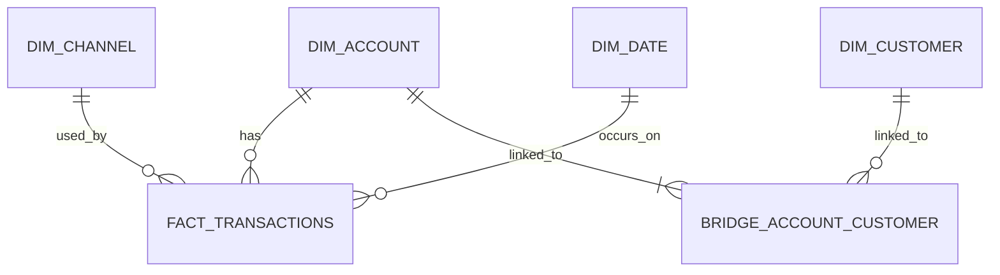

# 05 — Dimensional Data Model

## 1. Purpose

The dimensional model supports transaction reporting in Metabase.

The design keeps the reporting model small while correctly handling joint accounts.

---

## 2. Reporting Business Process

> **Retail banking transaction processing**

---

## 3. Fact Table Grain

The declared grain is:

> **One row in `marts.fact_transactions` represents one validated financial transaction processed against one account.**

The grain must not change within the fact table.

---

## 4. Slowly Changing Dimension Strategy

The project explicitly uses **Slowly Changing Dimension Type 1 (SCD Type 1)** for:

```text
marts.dim_customer
marts.dim_account
```

Type 1 means:

- the business key remains stable
- a new business key inserts a new dimension row
- an existing business key updates the current row
- changed descriptive attributes overwrite previous values
- no historical dimension versions are retained

Example:

```text
Before:
account_id = ACC001
account_status = ACTIVE

After:
account_id = ACC001
account_status = DORMANT
```

The existing `ACC001` dimension row is updated to `DORMANT`.

The model does not currently use SCD Type 2 fields such as:

```text
valid_from
valid_to
is_current
version_number
```

This is intentional because the current reporting questions require the latest descriptive state rather than historical dimension-state analysis.

If a future requirement asks questions such as:

> What was the account status at the exact time a historical transaction occurred?

then SCD Type 2 should be reconsidered.

---

## 5. Fact Table

### `marts.fact_transactions`

Foreign keys:

- `account_key`
- `channel_key`
- `date_key`

Business identifier retained as a degenerate identifier:

- `transaction_id`

Transaction descriptors retained in the fact because they describe the event itself:

- `transaction_type`
- `status`
- `currency_code`
- `transaction_timestamp`

Measure:

- `amount`

Transaction count is derived with `COUNT(*)`; a physical `transaction_count` column is unnecessary.

---

## 6. Dimensions

### `marts.dim_account`

Describes the current state of the account involved in a transaction.

**SCD strategy:** Type 1.

Attributes:

- account business identifier
- account type
- account status
- opened date
- closed date

### `marts.dim_channel`

Describes the channel through which the transaction was processed.

Attributes:

- channel code
- channel name

### `marts.dim_date`

Provides calendar attributes for trend reporting.

Attributes:

- date
- day name
- month
- quarter
- year

### `marts.dim_customer`

Describes the current state of customers who hold accounts.

**SCD strategy:** Type 1.

The transaction fact does not link directly to Customer because Account–Customer is many-to-many.

---

## 7. Many-to-Many Reporting Design

Customer and Account have a many-to-many relationship.

The dimensional model resolves this through:

### `marts.bridge_account_customer`

**Grain:** one row per account-customer relationship.

Columns:

- `account_key`
- `customer_key`
- `holder_role`
- `allocation_weight`

The bridge allows Metabase or SQL queries to navigate:

```text
Fact Transaction
      ↓
Dim Account
      ↓
Bridge Account Customer
      ↓
Dim Customer
```

---

## 8. Allocation Rule

A transaction belongs to an account, not directly to a single customer.

Joining a transaction to all holders of a joint account duplicates the transaction across customers.

To keep bank-level totals correct:

- bank-wide and account-level metrics must query the fact table without joining through the bridge
- customer-level transaction value uses an allocation weight

Allocation:

```text
allocation_weight = 1 / number_of_holders_on_the_account
```

Examples:

| Account holders | Weight per holder |
|---:|---:|
| 1 | 1.000000 |
| 2 | 0.500000 |
| 3 | 0.333333 |

Customer-allocated transaction value:

```text
allocated_amount = transaction_amount * allocation_weight
```

This prevents customer-level allocated totals from exceeding the original bank-level amount.

---

## 9. Dimensional ERD



---

## 10. Core Measures

The model supports:

- transaction count
- total transaction value
- successful transaction count
- failed transaction count
- reversed transaction count
- success rate
- transaction value by channel
- transaction count by channel
- transaction trend over time
- allocated transaction value by customer

---

## 11. KPI Definitions

### Transaction Count

```text
COUNT(*)
```

### Total Transaction Value

```text
SUM(amount)
```

### Success Rate

```text
SUCCESSFUL transactions / all transactions
```

### Failed Transactions

```text
COUNT(*) WHERE status = 'FAILED'
```

### Reversed Transactions

```text
COUNT(*) WHERE status = 'REVERSED'
```

### Customer Allocated Value

```text
SUM(amount * allocation_weight)
```

when joining through `bridge_account_customer`.

---

## 12. Dimension Change Behaviour

### New Customer

```text
customer_id not found
→ INSERT into dim_customer
```

### Existing Customer with Changed Attributes

```text
customer_id found
→ UPDATE existing dim_customer row
```

### New Account

```text
account_id not found
→ INSERT into dim_account
```

### Existing Account with Changed Attributes

```text
account_id found
→ UPDATE existing dim_account row
```

This is the practical Type 1 load pattern used by the project.

---

## 13. Design Boundary

The dimensional model contains:

```text
fact_transactions
dim_account
dim_customer
dim_channel
dim_date
bridge_account_customer
```

No additional fact tables are required for the current reporting scope.
